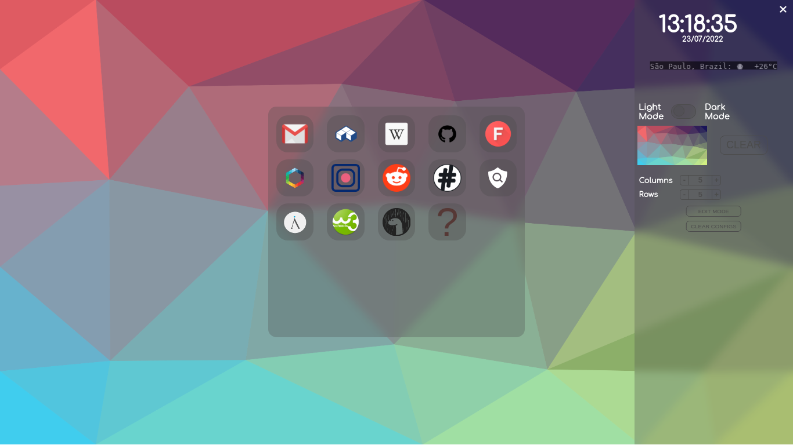

# Fire-Startpage
It's a simple startpage with animations and blur effect. \
The mininum resolution recommended is 1024x768 for a better experience.
Fire-Startpage is made for a desktop browser and it is cross-browser. And the add/remove entry function, is implemented on front-end. :)  \
I made it to be part of the front-end sample of my portfolio.

And it has some customizations. ;)

The edit mode, with the add/remove functions.

## Installation
Download it and enter in your browser configurations, after it, you just need to set the homepage of the browser to the location of the *index.html* file of the Fire-Startpage in your system. :)

## Considerations
The weather function in the sidebar is provided by the @chubin/wttr.in weather app. The alias for the Fire-Startpage is just Homepage. You may experience some glitches in animations and even in the blur effect dependending on your browser environment. \
If you are using **Firefox 100** or older browsers, you will have to use [fallbackBlur.js](https://gist.github.com/Firespindash/54fe91a3b4c42c83a51917b182d3e15c) to have blur effect. To implement it, take the `:before` css of the old version and create one for the input `div`. You should need to call the function only for the input and the side menu, when adding/editing/removing an item, on the background and clear buttons, columns and rows buttons and for the edit mode and clear configs buttons. \
The images that come with the startpage are made by me, even thought they are similar to or based on someone's else image. However, you can use the image you want to, and when adding a new website item you can use *.png* and *.svg* images to be the icons.

## More Images
Homepage with configurations changed.

Homepage with another changed configurations layout.

Homepage with edit input.

Homepage with less items.
