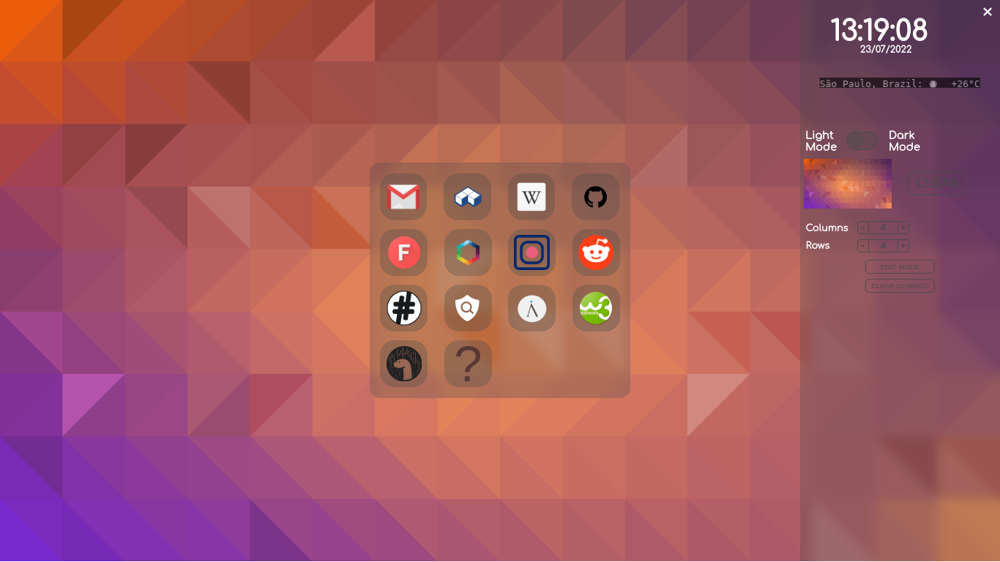
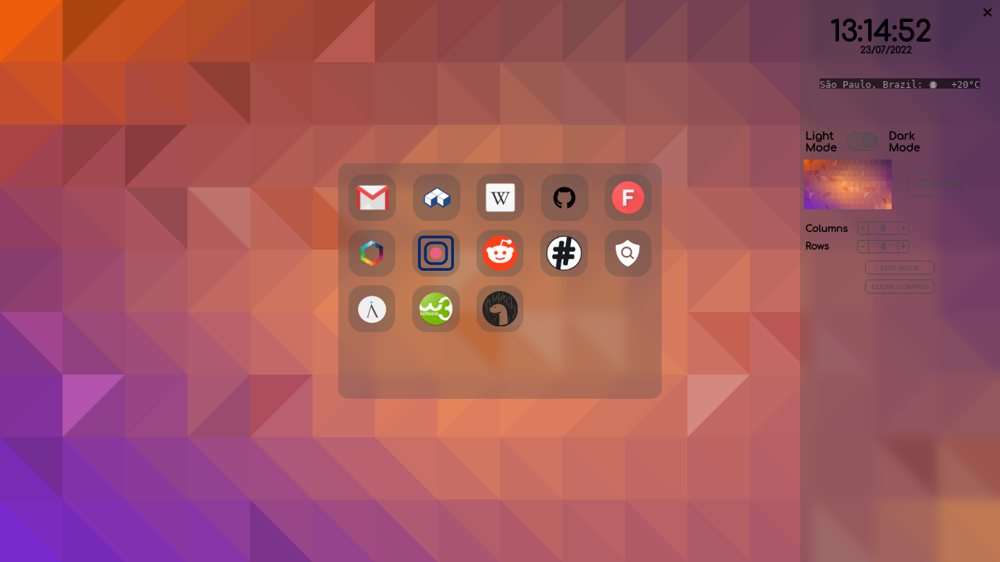

# Fire-Startpage
It's a simple startpage with animations and blur effect. \
The mininum resolution recommended is 1024x768 for better experience.
Fire-Startpage is for a desktop browser and it is cross-browser, even the blur effect. :) 
I made it to be part of the front-end sample of my portfolio.

And it has some customization.

## Installation
Download it and enter in your browser configurations, after it, you just need to set the homepage of the browser to the location of the *index.html* file of the Fire-Startpage in your system. :)

## Considerations
The weather function in the sidebar is provided by the @chubin/wttr.in weather app. The alias for the Fire-Startpage is just Homepage. To add a new website to the menu, you have to add it inside the *index.html*, I could have done an add/remove entry function, but it would require some back-end programming and I made this to be part of the front-end sample of my portfolio, because of that, I couldn't add any server-side/back-end code to it. You may experience some glitches in animations and even in the blur effect dependending on your browser environment. The images that come with the startpage are made by me, even thought they are similar to someone's image or based on someone's image. However, you can use the image you want to, and when adding a new website item you can use *.png* and *.svg* images to be the icons.

## More Images
Homepage with configurations changed.

Homepage with another changed configurations layout.
